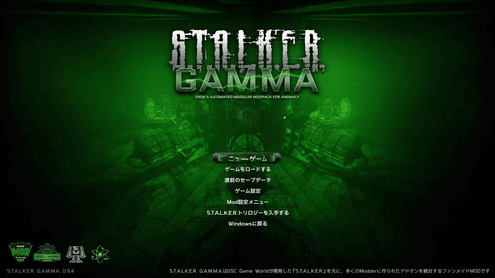

## STALKER GAMMA 日本語化

更新履歴: [**CHANGELOG.md**](./CHANGELOG.md)

> [!IMPORTANT]
> This is an unofficial Japanese localization for STALKER GAMMA. It is not affiliated with the official development team.  Please do not seek support for this localization through the official GAMMA Discord server.

> [!NOTE]
> **STALKER GAMMAの導入手順**については、こちらの[Steamコミュニティガイド](https://steamcommunity.com/sharedfiles/filedetails/?id=3158303765)を参考にしてください。

## 導入方法
 1. [Releases](https://github.com/shitame0451/STALKER-GAMMA-Japanese-Localization/releases/latest)から日本語化Modのzipファイルをダウンロード
 2. Mod Organizer 2で `Ctrl+M` を押してModの選択ウィンドウを開き、ダウンロードしたzipファイルを選択（または、MO2のModリストにzipファイルをドラッグ&ドロップ）
 3. fomodインストーラーの指示に従ってインストール
 4. Modリストに追加された日本語化Modのチェックボックスを有効化
 5. ゲームを起動し、メニュー画面が日本語になっていれば導入成功

## GOG版について
インストール先の「GAMMA」フォルダにある ModOrganizer.exe を実行し、導入方法に従って導入してください。

## 他アドオンとの併用について
本Modは他のアドオンと併用可能ですが、日本語環境での表示を改善するため、一部のスクリプト（`.script`）を変更しています。  
そのため、導入するアドオンによってはスクリプトファイルが競合し、日本語の表示乱れやクラッシュの原因となる可能性があります。  
競合によるクラッシュを防ぐため、追加アドオンは優先度を高く（Modリストで下に配置）して本Modを上書きするようにしてください。

## 日本語対応しているアドオン一覧
本Modには、GAMMAのデフォルト状態で有効化されていないアドオンや、一部アドオンに対応する翻訳ファイルも同梱しています。  
**以下のリストにあるアドオンは、導入するだけで自動的に日本語化が適用されます。**
| アドオン名 | 対応バージョン |
| :--- | :--- |
| [MCM Key Wrapper (ModDB)](https://www.moddb.com/mods/stalker-anomaly/addons/mcm-key-wrapper) | - |
| [New Item Highlight (ModDB)](https://www.moddb.com/mods/stalker-anomaly/addons/new-item-highlight) | `v2` |
| [Dynamic Reload Speeds (GitHub)](https://github.com/Verdatim25/Dynamic-Reload-Speeds/releases/) | `v1.0` |
| [GAMMA Mags Reloaded (Discord](https://discord.com/channels/912320241713958912/1322655858240262304/1322655858240262304) | `v1.02` |
| [AmmoCheck Enhanced (ModDB)](https://www.moddb.com/mods/stalker-anomaly/addons/ammocheck-enhanced) | `v3.0` |
| [xlibs (ModDB)](https://www.moddb.com/mods/stalker-anomaly/addons/xlibs-1001) | `v1.7.6` |
| [AlifePlus (ModDB)](https://www.moddb.com/mods/stalker-anomaly/addons/alifeplus-v1-0-01) | `v1.7.6` |

## 本Modについて
この日本語化Modは「S.T.A.L.K.E.R. Anomaly 1.5.2日本語化MOD」および「EFP 4.2日本語化MOD」を基に制作を始めています。  
両Modの作者・翻訳者の皆様に心より感謝申し上げます。

GAMMAには「[GAMMA Massive Text Overhaul Project（GMTOP）](https://www.moddb.com/mods/stalker-anomaly/addons/na243662)」というアドオンが含まれています。  
これはSTALKER Anomalyの文章に含まれる誤表記や不自然な表現を修正し、読みやすさと全体の品質を向上させるアドオンです。

本Modでは、GMTOPの最新版を基に翻訳を行っています。  
参考にさせていただいた日本語化Modとは翻訳元が異なるため、訳語や表現に違いが生じる場合があります。

また、日本語環境で自然な見え方になるように改行や空白の調整を行っています。  
そのため、GMTOP本来の表記とは完全に一致しない場合があります。あらかじめご了承ください。

> [!IMPORTANT]
> GAMMAおよびGMTOPは現在も制作途中のため、文章が実際のゲームの仕様と一致しない場合があります。  
> また、GAMMAのアップデートにより仕様が変更され、翻訳が正しく反映されなくなる場合があります。

## フォントについて
このModに含まれるフォントテクスチャは以下のフォントを基に作成・改変し、STALKERで使用可能なDDS形式に変換したものです。

使用フォント: VL PGothic, IBM Plex Sans, Tomorrow

各フォントのライセンス条項（改変、再配布、帰属表示）は「[**licenses**](fonts/licenses)」フォルダをご確認ください。  
本Modに含まれるフォントテクスチャを利用する際は元フォントのライセンス条件が適用されます。

## 各リンク
- STALKER GAMMA: https://discord.com/invite/stalker-gamma
- 100 Rads Bar(JP): https://discord.com/invite/VqSNxrReVn
- GAMMA Massive Text Overhaul Project: https://www.moddb.com/mods/stalker-anomaly/addons/na243662
- STALKER GAMMAの導入方法: https://steamcommunity.com/sharedfiles/filedetails/?id=3158303765
